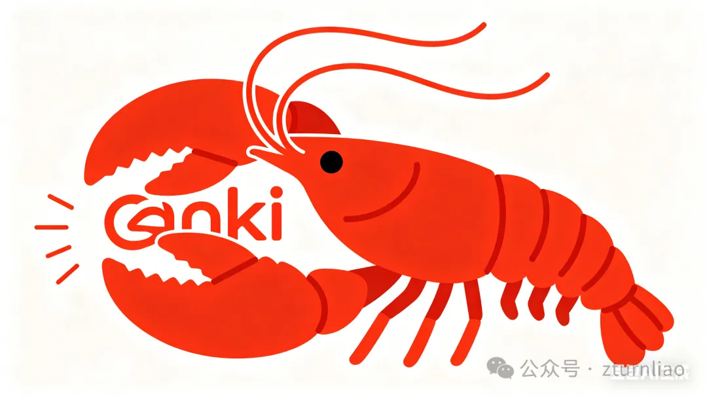

Title: OpenClaw + Anki: 龙虾又接管了一款软件
Date: 2026-05-01
Category: AI
Tags: OpenClaw, Anki, AI智能体, 知识管理, 间隔重复
Slug: openclaw-anki
Author: hillerliao
Summary: 让 OpenClaw 接管 Anki，把建牌组、批量制卡、搜索和复习提醒变成一句话就能完成的日常操作。

我最近在干一件事：把我所有常用的软件，都交给 OpenClaw 管。

这不是什么宏大计划，就是一次使用习惯上的彻底转向。以前，我用浏览器要打开浏览器，用笔记要打开 Obsidian，用 Anki 要打开 Anki Desktop。每个软件都有自己的界面、自己的操作逻辑、自己的那一套折腾人的流程。

现在，我只想打开 OpenClaw。我想让它成为我操作的统一入口。我说什么，它去各个软件里执行。

Anki 是我最新收编的一个。

---

为什么是 Anki
---------

简单说，Anki 是一个间隔重复系统。你把知识点做成卡片，它会根据你记得牢不牢，自动安排下次复习时间。用久了，它会变成你的长期记忆库。

但 Anki 有个一直让我不舒服的地方：它明明那么重要，但往里面喂知识的过程太原始了。

复制，粘贴，新建卡片，选牌组，打标签。一张还行。十张开始烦。五十张想摔电脑。

更痛苦的是，很多时候你明明知道这段内容该进 Anki——一篇文章里的关键概念、一份考试资料的易错点、Obsidian 里随手记的笔记——但一想到要手动拆卡，你就对自己说"算了，晚点再说"。

然后就就是"算了，算了"。

这个问题一直存在，但我以前没想通怎么解决。直到我开始用 OpenClaw。

---

我要的不是插件，是入口
-----------

OpenClaw 对我来说，不是一个聊天机器人。它是一个可以长期在线、可以调用工具、可以替我执行操作的 Agent。

我想要的是：**以后只要是操作 Anki 的事，我就在 OpenClaw 里跟它说一声，它去办。**

不是"它建议我怎么操作"，不是"它给我一段代码让我自己跑"。是它真的去操作。

我说话，它干活。

---

现在我是这么用的
--------

先说 Anki 里最基础的操作。建牌组、批量建卡、搜索、改标签、跨牌组移动，OpenClaw 全能干。

比如：

> "帮我新建一个国考错题牌组。"  
> "把这 50 个单词批量导进 N5 牌组，正面日语，背面中文。"  
> "查一下 biology 牌组里这周新加了什么。"  
> "从日语 N3 和 N4 里找出所有带『ます形』的卡片，复制到语法复习牌组。"

这些事它几秒钟干完。以前我手动做，少则几分钟，多则半小时。这叫"接管操作"。

但真正让我觉得爽的，是下面这些。

**读文章**

刷到一篇文章，里面有个观点很戳我："要相信时间的力量，相信成长的力量，不要在小事上跟孩子大动干戈，让孩子多感受爱，因为童年的爱里，藏着孩子一生的力量和光。"复制这段话，切到 OpenClaw：

> "帮我做张 Anki 卡片，记到读书笔记牌组里。"

不用想正反面怎么写，不用管格式。它自己判断。我继续读文章。

**陪娃**

晚上娃唱"Elephants have wrinkles"，我觉得歌词不错，想记下来。

> "你把这首歌的歌词找到，做成 Anki 卡片。"

它自己去搜，自己决定卡片结构，自己存。我陪娃继续玩。

**刷推特**

刷到一条："Vibe Coding 加持之下，一人公司，代码实现不是最关键的。最关键的是怎么找到愿意为你的产品和服务付费的用户。"

我觉得这句话说得太准了，想存下来。

> "这条推特给我存一下 Anki 卡片。"

它知道该放哪个牌组（我设过规则：推特精华进『灵感池』），用什么格式。我继续刷。

这些场景的共同点是：**我不需要停下来"进入整理状态"**。碰到值得记的东西，顺手扔给 OpenClaw，十秒以内搞定。不打断正在做的事。

以前是"我先记下来，晚点再整理进 Anki"——然后就没有然后了。现在是"OpenClaw，帮我存一下"——然后它真存了。

---

更多玩法：不只是"我找它"，还能"它找我"
---------------------

上面说的都是"我主动找 OpenClaw"。但 OpenClaw 是 7×24 小时跑着的，它可以反过来找我。

**定时复习提醒**

> "每天上午 10 点，从国考错题牌组里随机抽 5 张卡片，发给我。"

OpenClaw 到点就推过来。不用打开 Anki，在聊天窗口里就能过一遍。

**复习进度日报**

> "每天晚上 11 点，告诉我今天学了多久、复习了多少张卡、哪个牌组欠的债最多。"

第二天早上我看一眼，就知道今天该补哪块。

**卡片过期预警**

> "检查一下『N1 语法』牌组里，有没有超过 6 个月没复习的卡片，列出来问我是否删除或归档。"

OpenClaw 自己去搜，然后把结果推给我，我一句话就处理了。

**主动补卡**

OpenClaw 知道我最近在读什么文章、在 Obsidian 里记了什么笔记。它可以自己判断：

> "你昨天记的那段关于 MCP 协议的笔记，好像还没做成 Anki 卡片，要不要我帮你生成几张？"

我说"好"，它就做了。我说"不用"，它就不打扰。

**随机投喂**

> "每周末下午 3 点，随机从我的所有牌组里抽 10 张卡片发给我，当周末小测验。"

不知不觉就把边边角角的知识回顾了一遍。

**复习节奏提醒**

Anki 自己虽然有复习提醒，但那是"软件内的"。我经常打开 Anki 才看到有 200 张卡等着我，然后压力很大。

换个方式：

> "每天早上 9 点，检查今天到期的卡片数量，如果超过 50 张就提醒我'今天债有点多，早点开始复习'，如果少于 10 张就说'今天轻松，可以多往前学点新的'。"

OpenClaw 自己判断，自己调整话术。像个学习搭子。

核心变化是什么？以前是我追着知识跑——我得记得去打开 Anki，得记得今天该复习哪个牌组，得自己安排节奏。

现在是知识来找我。OpenClaw 替我把节奏安排好了。到点推送，逾期提醒，主动补卡。

我不用记"今天该复习什么"。我只管看它发给我的东西。

---

技术上怎么实现的
--------

市面上其实早就有类似方案，最主流的是给 Anki Desktop 装一个 AnkiConnect 插件，开一个本地接口。但这里有个现实问题：Anki Desktop 得一直开着。

如果你的 Agent 跑在自己电脑上还凑合。但 OpenClaw 是 7×24 小时跑在服务器上的，我不可能在服务器上长期开一个带图形界面的桌面软件。关掉 Anki 就断连，电脑睡眠也断连。Agent 明明一直醒着，Anki 却只能在我打开电脑的时候被操作。

所以我真正想要的是——Anki 自己也变成一个服务器上的服务。

换一条路。方案比你想的简单。

如果你只是想给 OpenClaw 用（它帮你建卡、整理、提醒），让 OpenClaw 和 Anki 服务跑在同一台机器上，走 localhost 就够了。不需要域名，不需要 HTTPS 证书，不需要折腾 nginx。

甚至你都不用手动部署。把踩坑总结好的部署指南扔给 OpenClaw，说一句"按这份指南，在你自己的机器上把 Anki 服务部署起来"，它自己就能搞定。

架构是三层：数据层（Anki 同步服务）、API 层（REST 接口）、桥接层（MCP 包装）。因为全跑在本机，省去了公网那一堆麻烦。

如果你还想用自己的 Anki 客户端（电脑或手机）也连上这套服务正常复习，那服务就需要走公网。至少需要一个公网 IP 地址。Anki 的同步协议不强制 HTTPS，公网 IP 加端口就能用。

两个场景，两种复杂度。看你自己需要哪一种。

数据备份还是要做的。我每半小时把数据库同步到坚果云。服务器挂了不怕，卡片丢了才是真难受。

---

哪些人值得试试
-------

**第一类，Anki 重度用户。** 牌组成百上千张，每天花大量时间整理卡片。OpenClaw 能把整理时间从几十分钟压缩到几秒。

**第二类，已经在用 OpenClaw 这类 Agent 的人。** 想让 Agent 真能干点活，不只是聊天。Anki 是一个很好的切入点。

**第三类，有"收集癖"但"整理懒"的人。** 看到好东西就想存，但存完就不管了。OpenClaw 能把"存"和"整理"合并成一步。

如果你只是偶尔背几个单词，真没必要折腾这个。手动就够了。

---

不想折腾怎么办
-------

有两种办法。

**第一种，让 OpenClaw 自己部署。** 你把踩坑总结的部署指南扔给它，它自己在本机把服务跑起来。这是最省心的。

**第二种，找我远程指导。** 如果你属于上面说的三类人，但不想自己踩坑，可以找我。我踩过的坑，你就不用再踩一遍了。

---

我正在把一切都交给 OpenClaw
------------------

不只是 Anki。浏览器、笔记软件、提醒事项、文件管理……我希望有一天，所有我常用的软件，都能在 OpenClaw 里操作。

我不想再学每个软件怎么用。我只想学会怎么跟 OpenClaw 说话。

Anki 是这一步里很小的一块，也是让我觉得最爽的一块。因为它解决了那个困扰我很久的问题——明明知道该复习，但懒得整理。

现在不用整理了。OpenClaw 替我干。

我只管学。

如果你想直接拿到完整部署方案——扫码联系我，免费领取部署指南。

---

原文链接：[OpenClaw + Anki: 龙虾又接管了一款软件](https://mp.weixin.qq.com/s/-J-Dqic2Hi8V7M3fkAVg1g)
